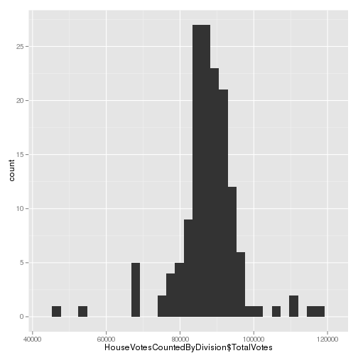

AEC ANALYSIS R SCRIPT
=====================
Author: Steve McEachern
Date: 


```r
date()
```

```
## [1] "Mon Sep  3 11:08:13 2012"
```


github: git@github.com:stevenmce/aec_analysis.git
This is a special R script which can be used to generate a report. You can
write normal text in roxygen comments.

First we set up some options (you do not have to do this):


The report begins here.


```r
# This code reads in the data
```


READ IN DATA
============
This section reads in the data files
FIRST PREFERENCE VOTES 2010 BY _Candidate_ CSV file
===================================================
Code from Simon Jackman - source is comments section of:
http://jackman.stanford.edu/blog/?p=1760 
LOAD
----
Define the location of the data (AEC website)


```r
theURL <- "http://results.aec.gov.au/15508/Website/Downloads/HouseFirstPrefsByCandidateByVoteTypeDownload-15508.csv"
```


Read in the data


```r
First_Preferences_By_Candidate_By_Vote_Type <- read.csv(url(theURL), skip = 1, 
    header = TRUE, quote = "\"", stringsAsFactors = FALSE)
```


CLEAN
-----
Vote counts occuring by type
Define variables


```r
vars <- c("OrdinaryVotes", "AbsentVotes", "ProvisionalVotes", "PrePollVotes", 
    "PostalVotes", "TotalVotes")
```


DO
--
Aggregate votes by division (sum all candidates)


```r
out <- NULL
for (v in vars) {
    theVar <- First_Preferences_By_Candidate_By_Vote_Type[, match(v, names(First_Preferences_By_Candidate_By_Vote_Type))]
    out <- cbind(out, tapply(theVar, First_Preferences_By_Candidate_By_Vote_Type$DivisionNm, 
        sum, na.rm = TRUE))
}
```


Define variable names


```r
outvars <- c("OrdinaryVotes", "AbsentVotes", "ProvisionalVotes", "PrePollVotes", 
    "PostalVotes", "TotalVotes", "DivisionName")

z <- apply(out, 2, function(x) sum(x != 0))
names(z) <- vars
print(z)
```

```
##    OrdinaryVotes      AbsentVotes ProvisionalVotes     PrePollVotes 
##              150              150              150              150 
##      PostalVotes       TotalVotes 
##              150              150 
```

```r

## Swing against ALP candidates THIS CODE TO GENERATE SWING DOESNT WORK??
## swing <- aggregate(First_Preferences_By_Candidate_By_Vote_Type,
## list(Party = First_Preferences_By_Candidate_By_Vote_Type['PartyAb' =
## 'ALP']), mean) print(swing)
```


Convert out data matrix to a data frame


```r
outdf <- as.data.frame(out)
```


Transform division from row.names to a variable 
http://stackoverflow.com/questions/11427434/how-to-create-a-variable-of-rownames


```r
outdf$Division = rownames(outdf)
rownames(outdf) = NULL
```


Assign column (variable) names


```r
colnames(outdf) <- outvars
```


Describe the data


```r
describe(outdf)
```

```
## outdf 
## 
##  7  Variables      150  Observations
## ---------------------------------------------------------------------------
## OrdinaryVotes 
##       n missing  unique    Mean     .05     .10     .25     .50     .75 
##     150       0     149   73852   61940   65536   69770   74234   78000 
##     .90     .95 
##   81693   83883 
## 
## lowest :  42257  47881  57272  57375  57801
## highest:  88520  89736  94172 103628 105358 
## ---------------------------------------------------------------------------
## AbsentVotes 
##       n missing  unique    Mean     .05     .10     .25     .50     .75 
##     150       0     149    4821    2561    3042    4108    4878    5761 
##     .90     .95 
##    6488    7078 
## 
## lowest :  791  924 1547 1688 1708, highest: 7279 7523 7618 7902 8826 
## ---------------------------------------------------------------------------
## ProvisionalVotes 
##       n missing  unique    Mean     .05     .10     .25     .50     .75 
##     150       0     114   248.9   118.5   143.9   171.5   229.0   299.5 
##     .90     .95 
##   402.4   446.2 
## 
## lowest :  77  81  84  99 101, highest: 512 522 609 615 656 
## ---------------------------------------------------------------------------
## PrePollVotes 
##       n missing  unique    Mean     .05     .10     .25     .50     .75 
##     150       0     150    3240    1768    1967    2466    3053    3791 
##     .90     .95 
##    4808    5206 
## 
## lowest : 1393 1653 1663 1668 1677, highest: 5663 5711 6174 6682 6745 
## ---------------------------------------------------------------------------
## PostalVotes 
##       n missing  unique    Mean     .05     .10     .25     .50     .75 
##     150       0     150    5383    3276    3529    4284    5166    6386 
##     .90     .95 
##    7216    7874 
## 
## lowest :  1242  2049  2736  2849  2921
## highest:  8267  8295  8471  9627 11118 
## ---------------------------------------------------------------------------
## TotalVotes 
##       n missing  unique    Mean     .05     .10     .25     .50     .75 
##     150       0     150   87544   75664   80588   84404   87798   91302 
##     .90     .95 
##   94484   97121 
## 
## lowest :  46409  53672  67294  67896  68216
## highest: 105033 109950 110052 116712 117911 
## ---------------------------------------------------------------------------
## DivisionName 
##       n missing  unique 
##     150       0     150 
## 
## lowest : Adelaide  Aston     Ballarat  Banks     Barker   
## highest: Wentworth Werriwa   Wide Bay  Wills     Wright    
## ---------------------------------------------------------------------------
```


CLEAN UP
--------
Rename the data frame


```r
jackman_votetype_by_division <- outdf
remove(outdf)
remove(out)
```


FILE TWO
========
FIRST PREFERENCE RESULTS BY _Division_ - HTML table
IF REQUIRED:
remove(HouseFirstPrefsTppByDivision)

LOAD
----
READ IN DATA - NOTE StringsAsFactors - False to avoid FACTOR problems


```r
HouseFirstPrefsTppByDivision <- readHTMLTable("http://results.aec.gov.au/15508/Website/HouseFirstPrefsTppByDivision-15508-NAT.htm", 
    header = c("Division", "State", "ALP_1Prf", "LP_1Pref", "LNQ_1Pref", "GRN_1Pref", 
        "NP_1Pref", "OTH_1Pref", "ALP_2PP", "LNP_2PP"), skip.rows = c(1, 2), 
    trim = TRUE, as.data.frame = TRUE, which = 5, stringsAsFactors = FALSE)
```


Describe the data


```r
describe(HouseFirstPrefsTppByDivision)
```

```
## HouseFirstPrefsTppByDivision 
## 
##  10  Variables      151  Observations
## ---------------------------------------------------------------------------
## Division 
##       n missing  unique 
##     151       0     151 
## 
## lowest : Adelaide  Aston     Ballarat  Banks     Barker   
## highest: Wentworth Werriwa   Wide Bay  Wills     Wright    
## ---------------------------------------------------------------------------
## NA 
##       n missing  unique 
##     151       0       9 
## 
##           37.99 ACT NSW NT QLD SA TAS VIC WA
## Frequency     1   2  48  2  30 11   5  37 15
## %             1   1  32  1  20  7   3  25 10
## ---------------------------------------------------------------------------
## NA 
##       n missing  unique 
##     151       0     150 
## 
## lowest : 13.49 17.11 19.22 19.27 19.89
## highest: 58.81 59.98 62.12 64.25 8.13  
## ---------------------------------------------------------------------------
## NA 
##       n missing  unique 
##     151       0     110 
## 
## lowest : 0.00  16.52 19.08 19.90 21.00
## highest: 62.12 62.66 64.45 64.98 9.12  
## ---------------------------------------------------------------------------
## NA 
##       n missing  unique 
##     151       0      32 
## 
## lowest : 0.00  11.76 26.60 35.80 37.10
## highest: 58.33 58.86 61.25 61.85 65.52 
## ---------------------------------------------------------------------------
## NA 
##       n missing  unique 
##     151       0     145 
## 
## lowest : 10.01 10.09 10.15 10.19 10.33
## highest: 9.61  9.62  9.67  9.72  9.97  
## ---------------------------------------------------------------------------
## NA 
##       n missing  unique 
##     151       0      18 
## 
##           0.00 17.70 2.54 21.21 25.22 28.85 31.05 34.39 42.47 44.77 5.32
## Frequency  134     1    1     1     1     1     1     1     1     1    1
## %           89     1    1     1     1     1     1     1     1     1    1
##           5.98 50.77 52.41 53.00 59.23 6.94 66.79
## Frequency    1     1     1     1     1    1     1
## %            1     1     1     1     1    1     1
## ---------------------------------------------------------------------------
## NA 
##       n missing  unique 
##     151       0     136 
## 
## lowest : 0.00 0.01 1.28 1.41 1.57, highest: 9.36 9.37 9.46 9.49 9.67 
## ---------------------------------------------------------------------------
## NA 
##       n missing  unique 
##     151       0     147 
## 
## lowest : 25.59 27.00 27.11 29.65 31.14
## highest: 72.25 72.64 73.30 73.90 74.91 
## ---------------------------------------------------------------------------
## NA 
##       n missing  unique 
##     150       1     146 
## 
## lowest : 25.09 26.10 26.70 27.36 27.75
## highest: 68.86 70.35 72.89 73.00 74.41 
## ---------------------------------------------------------------------------
```


Apply variable names to columns


```r
HouseFirstPrefsTppByDivision_varnames <- c("Division", "State", "ALP_1Prf", 
    "LP_1Pref", "LNQ_1Pref", "GRN_1Pref", "NP_1Pref", "OTH_1Pref", "ALP_2PP", 
    "LNP_2PP")
colnames(HouseFirstPrefsTppByDivision) <- HouseFirstPrefsTppByDivision_varnames
```


CLEAN
-----
Recode values of NATIONAL TOTAL due to missing State value
select rows where v1 is 99 and recode column v1 


```r
HouseFirstPrefsTppByDivision[HouseFirstPrefsTppByDivision$Division == "National Total", 
    "State"] <- "National"
HouseFirstPrefsTppByDivision[HouseFirstPrefsTppByDivision$Division == "National Total", 
    "ALP_1Prf"] <- 37.99
HouseFirstPrefsTppByDivision[HouseFirstPrefsTppByDivision$Division == "National Total", 
    "LP_1Pref"] <- 30.46
HouseFirstPrefsTppByDivision[HouseFirstPrefsTppByDivision$Division == "National Total", 
    "LNQ_1Pref"] <- 9.12
HouseFirstPrefsTppByDivision[HouseFirstPrefsTppByDivision$Division == "National Total", 
    "GRN_1Pref"] <- 11.76
HouseFirstPrefsTppByDivision[HouseFirstPrefsTppByDivision$Division == "National Total", 
    "NP_1Pref"] <- 3.73
HouseFirstPrefsTppByDivision[HouseFirstPrefsTppByDivision$Division == "National Total", 
    "OTH_1Pref"] <- 6.94
HouseFirstPrefsTppByDivision[HouseFirstPrefsTppByDivision$Division == "National Total", 
    "ALP_2PP"] <- 50.12
HouseFirstPrefsTppByDivision[HouseFirstPrefsTppByDivision$Division == "National Total", 
    "LNP_2PP"] <- 49.88

# CHECK CHANGES APPLIED CORRECTLY VALUES: National Total [STATE] 37.99
# 30.46 9.12 11.76 3.73 6.94 50.12 49.88
tail(HouseFirstPrefsTppByDivision)
```

```
##           Division    State ALP_1Prf LP_1Pref LNQ_1Pref GRN_1Pref NP_1Pref
## 146      Wentworth      NSW    21.07    59.57      0.00     17.44     0.00
## 147        Werriwa      NSW    48.57    38.72      0.00     12.70     0.00
## 148       Wide Bay      QLD    24.10     0.00     58.86     11.00     0.00
## 149          Wills      VIC    51.81    23.79      0.00     20.60     0.00
## 150         Wright      QLD    27.78     0.00     53.09     11.95     0.00
## 151 National Total National    37.99    30.46      9.12     11.76     3.73
##     OTH_1Pref ALP_2PP LNP_2PP
## 146      1.92   35.14   64.86
## 147      0.01   56.75   43.25
## 148      6.04   34.39   65.61
## 149      3.80   72.64   27.36
## 150      7.18   39.85   60.15
## 151      6.94   50.12   49.88
```

```r

# CREATE A State FACTOR VARIABLE
HouseFirstPrefsTppByDivision$State_factor <- as.factor(HouseFirstPrefsTppByDivision$State)

# RENAME THE DIVISION VARIABLE (FOR FILE MERGING)
HouseFirstPrefsTppByDivision$DivisionNm <- as.character(HouseFirstPrefsTppByDivision$Division)
HouseFirstPrefsTppByDivision$Division <- NULL
```


FILE THREE - HOUSE VOTES COUNTED BY DIVISION
============================================
LOAD
----
Define the location of the data (AEC website)


```r
theURL <- "http://results.aec.gov.au/15508/Website/Downloads/HouseVotesCountedByDivisionDownload-15508.csv"

## Read in the data
HouseVotesCountedByDivision <- read.csv(url(theURL), skip = 1, header = TRUE, 
    quote = "\"", stringsAsFactors = FALSE)

require(ggplot2)
```

```
## Loading required package: ggplot2
```

```r
quickplot(HouseVotesCountedByDivision$TotalVotes)
```

```
## stat_bin: binwidth defaulted to range/30. Use 'binwidth = x' to adjust
## this.
```

 

```r

# Run the following on the command line to generate R-markdown document
# spin(aec_read_data_knitr.r)
```


END OF FILE
